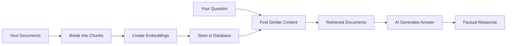
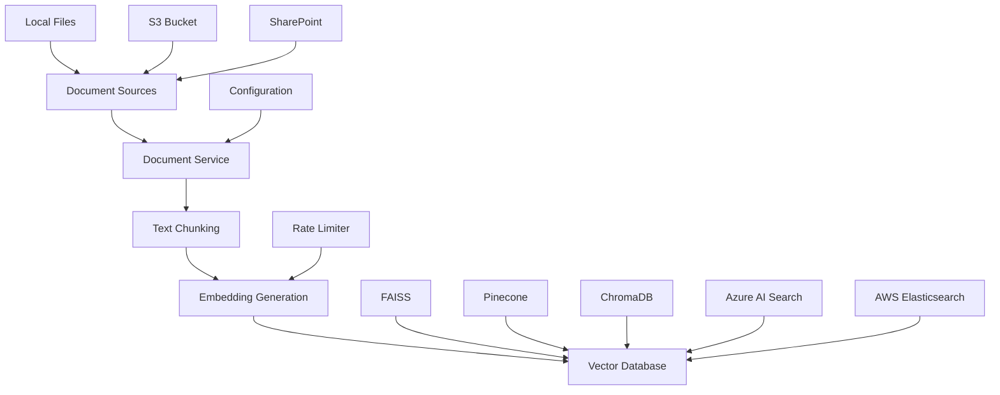

# nBedR - RAG Embedding Toolkit

A powerful tool for creating and managing embedding databases for Retrieval Augmented Generation (RAG) applications.

## Overview

### What Are Embeddings and Why Do They Matter?

Imagine you want to teach a computer to understand the meaning of words, sentences, and documents - not just the letters and spelling, but the actual **meaning** behind them. This is where embeddings come in.

**Embeddings** are like a universal translator for computers. They convert human language (text) into numbers that computers can understand and compare. Think of it like giving every piece of text a unique "fingerprint" made of numbers that captures its meaning.

Here's a simple analogy: If you were organizing books in a library, you wouldn't just sort them alphabetically. You'd group books by topic - science books near other science books, cooking books with other cooking books, etc. Embeddings do something similar but for any text - they help computers understand which pieces of text are similar in meaning, even if they use completely different words.

### How Embeddings Power Modern AI Applications

In **Generative AI (GenAI)** applications, embeddings are the secret sauce that makes AI systems truly intelligent. Here's how:

1. **Understanding Context**: When you ask an AI assistant a question, embeddings help it understand what you're really asking about, not just match keywords.

2. **Finding Relevant Information**: In **Retrieval Augmented Generation (RAG)** systems, embeddings help AI find the most relevant documents or passages to answer your questions, just like a very smart librarian who instantly knows which books contain information related to your question.

3. **Maintaining Consistency**: Embeddings ensure that AI responses are grounded in actual facts from your documents, rather than hallucinating information.

### The RAG Process Explained Simply



1. **Preparation Phase**: Your documents are broken into smaller pieces (chunks) and converted into embeddings
2. **Question Phase**: When you ask a question, the system finds the most relevant chunks using embeddings
3. **Answer Phase**: AI uses those relevant chunks to generate an accurate, factual answer

This application handles the **preparation phase** - the crucial foundation that makes everything else possible.

### Why This Application Matters

This tool provides a streamlined solution for processing documents, generating embeddings, and storing them in vector databases. Built on the foundation of the excellent RAFT toolkit, it focuses specifically on embedding operations and vector database management - essentially preparing your documents so they can be used effectively in AI applications.

## Features

### 🚀 Core Capabilities
- **Multi-format Document Processing**: PDF, TXT, JSON, PPTX, and more
- **Advanced Chunking Strategies**: Semantic, fixed-size, and sentence-aware chunking
- **Multiple Vector Databases**: FAISS, Pinecone, and ChromaDB support
- **Parallel Processing**: Efficient batch processing with configurable workers
- **Rate Limiting**: Smart API rate limiting to prevent quota exhaustion
- **Cloud Storage Integration**: S3, Azure Blob, and SharePoint support

### 🔧 Document Sources
- **Local Files**: Process files from local directories
- **Amazon S3**: Direct integration with S3 buckets
- **SharePoint**: Microsoft SharePoint document libraries
- **Batch Processing**: Handle large document collections efficiently

### 🎯 Vector Database Support
- **FAISS**: High-performance similarity search and clustering
- **Pinecone**: Managed vector database service
- **ChromaDB**: Open-source embedding database
- **Azure AI Search**: Microsoft's enterprise search service with vector capabilities
- **AWS Elasticsearch**: Amazon's managed Elasticsearch with vector search support

## Architecture



## Quick Start

### Installation

```bash
# Clone the repository
git clone https://github.com/your-org/rag-embeddings-db.git
cd rag-embeddings-db

# Install dependencies
pip install -r requirements.txt

# Or install with optional dependencies
pip install -e .[cloud,dev]
```

### Basic Usage

1. **Create embeddings from local documents:**
```bash
python rag_cli.py create-embeddings \
    --source local \
    --source-path ./documents \
    --vector-db faiss \
    --output-path ./embeddings_db
```

2. **Process documents from S3:**
```bash
python rag_cli.py create-embeddings \
    --source s3 \
    --source-path s3://my-bucket/documents/ \
    --vector-db pinecone \
    --pinecone-index my-index
```

3. **Use Azure AI Search:**
```bash
python rag_cli.py create-embeddings \
    --source local \
    --source-path ./documents \
    --vector-db azure_ai_search \
    --azure-search-service your-service-name \
    --azure-search-index rag-embeddings
```

4. **Use AWS Elasticsearch:**
```bash
python rag_cli.py create-embeddings \
    --source local \
    --source-path ./documents \
    --vector-db aws_elasticsearch \
    --aws-elasticsearch-endpoint https://your-domain.region.es.amazonaws.com
```

5. **Search for similar documents:**
```bash
python rag_cli.py search \
    --query "machine learning algorithms" \
    --vector-db faiss \
    --index-path ./embeddings_db \
    --top-k 5
```

### Configuration

Create a `.env` file with your configuration:

```env
# OpenAI Configuration
OPENAI_API_KEY=your_openai_api_key
EMBEDDING_MODEL=text-embedding-ada-002
EMBEDDING_DIMENSIONS=1536

# Vector Database Configuration
VECTOR_DB_TYPE=faiss
FAISS_INDEX_PATH=./embeddings_db

# Pinecone Configuration (if using Pinecone)
PINECONE_API_KEY=your_pinecone_api_key
PINECONE_ENVIRONMENT=your_environment
PINECONE_INDEX_NAME=your_index_name

# ChromaDB Configuration (if using ChromaDB)
CHROMA_HOST=localhost
CHROMA_PORT=8000

# Azure AI Search Configuration (if using Azure AI Search)
AZURE_SEARCH_SERVICE_NAME=your_search_service
AZURE_SEARCH_API_KEY=your_api_key
AZURE_SEARCH_INDEX_NAME=rag-embeddings

# AWS Elasticsearch Configuration (if using AWS Elasticsearch)
AWS_ELASTICSEARCH_ENDPOINT=https://your-domain.region.es.amazonaws.com
AWS_ELASTICSEARCH_REGION=us-east-1
AWS_ELASTICSEARCH_INDEX_NAME=rag-embeddings
AWS_ACCESS_KEY_ID=your_access_key
AWS_SECRET_ACCESS_KEY=your_secret_key

# Processing Configuration
CHUNK_SIZE=512
CHUNKING_STRATEGY=semantic
BATCH_SIZE=10
MAX_WORKERS=4
```

## Advanced Usage

### Custom Chunking Strategies

```bash
# Semantic chunking (uses embeddings to determine boundaries)
python rag_cli.py create-embeddings \
    --chunking-strategy semantic \
    --chunk-size 512 \
    --source local \
    --source-path ./docs

# Fixed-size chunking
python rag_cli.py create-embeddings \
    --chunking-strategy fixed \
    --chunk-size 1000 \
    --chunk-overlap 100 \
    --source local \
    --source-path ./docs
```

### Batch Processing

```bash
# Process large document collections
python rag_cli.py create-embeddings \
    --source s3 \
    --source-path s3://large-corpus/ \
    --batch-size 50 \
    --max-workers 8 \
    --rate-limit-requests 100 \
    --rate-limit-period 60
```

### Preview Mode

```bash
# Preview what will be processed without actually doing it
python rag_cli.py create-embeddings \
    --source local \
    --source-path ./documents \
    --preview
```

## API Usage

```python
from core.services.document_service import DocumentService
from core.config import EmbeddingConfig

# Initialize configuration
config = EmbeddingConfig()

# Create document service
service = DocumentService(config)

# Process documents
results = await service.process_documents(
    source_path="./documents",
    source_type="local"
)

print(f"Processed {len(results.chunks)} chunks")
print(f"Generated {len(results.embeddings)} embeddings")
```

## Understanding Chunking: The Art of Breaking Down Documents

### Why Chunking Matters

Think of chunking like cutting a pizza into slices - you need pieces that are the right size to be useful. If the slices are too big, they're hard to handle and contain too much mixed information. If they're too small, you lose important context and meaning.

When processing documents for AI, chunking determines how well your AI system can find and use relevant information. Good chunking means better, more accurate AI responses.

### Chunking Strategies Explained

#### 🎯 **Semantic Chunking** (Recommended for Most Use Cases)
**What it does**: Uses AI to understand the meaning and flow of your text, then creates natural breakpoints where topics change.

**Think of it like**: A smart editor who reads your document and says "this paragraph is about marketing, but this next section switches to finance" and makes a cut there.

**Best for**: 
- Mixed content (reports, manuals, articles)
- Documents with varying topic sections
- When you want the highest quality results

**Configuration**:
```env
CHUNKING_STRATEGY=semantic
CHUNK_SIZE=512
```

#### 📏 **Fixed-Size Chunking** (Most Predictable)
**What it does**: Creates chunks of exactly the same size, like cutting a rope into equal lengths.

**Think of it like**: Using a ruler to mark off exact measurements - every piece is the same size.

**Best for**:
- Consistent document types (legal docs, technical manuals)
- When you need predictable processing times
- Large volumes of similar content

**Configuration**:
```env
CHUNKING_STRATEGY=fixed
CHUNK_SIZE=1000
CHUNK_OVERLAP=100
```

#### 📝 **Sentence-Aware Chunking** (Natural Boundaries)
**What it does**: Breaks text at sentence endings, keeping complete thoughts together.

**Think of it like**: A careful reader who never cuts off someone mid-sentence.

**Best for**:
- Narrative content (stories, case studies)
- Interview transcripts
- Conversational content

**Configuration**:
```env
CHUNKING_STRATEGY=sentence
CHUNK_SIZE=500
```

### Chunk Size and Overlap: Finding the Sweet Spot

#### **Chunk Size Guidelines**

| **Content Type** | **Recommended Size** | **Why** |
|---|---|---|
| **Technical Documentation** | 800-1200 tokens | Complex concepts need more context |
| **Marketing Content** | 400-600 tokens | Concise, focused messages |
| **Legal Documents** | 1000-1500 tokens | Detailed context is crucial |
| **News Articles** | 300-500 tokens | Quick, digestible information |
| **Academic Papers** | 600-1000 tokens | Balance between detail and focus |

**Token Rule of Thumb**: 1 token ≈ 0.75 words in English, so 500 tokens ≈ 375 words

#### **Overlap: The Safety Net**

**What is overlap?**: When chunks share some content at their boundaries, like overlapping roof tiles.

**Why use overlap?**:
- **Prevents Context Loss**: Important information spanning chunk boundaries isn't lost
- **Improves Search**: Better chance of finding relevant information
- **Maintains Meaning**: Keeps related concepts together

**Overlap Guidelines**:
- **Standard**: 10-20% of chunk size
- **High Precision Needed**: 20-30% overlap
- **Performance Focused**: 5-10% overlap

```env
# Example: 1000 token chunks with 20% overlap
CHUNK_SIZE=1000
CHUNK_OVERLAP=200
```

### Configuration Impact Guide

#### **Chunk Size Impact**

**Larger Chunks (1000+ tokens)**:
- ✅ **Pros**: More context, better for complex topics, fewer total chunks
- ❌ **Cons**: Less precise retrieval, higher costs, slower processing

**Smaller Chunks (300-500 tokens)**:
- ✅ **Pros**: More precise retrieval, faster processing, lower costs
- ❌ **Cons**: May lose context, more chunks to manage

#### **Overlap Impact**

**High Overlap (25%+)**:
- ✅ **Pros**: Better information preservation, improved search accuracy
- ❌ **Cons**: More storage needed, increased processing time

**Low Overlap (5-10%)**:
- ✅ **Pros**: Efficient storage, faster processing
- ❌ **Cons**: Risk of losing information at boundaries

### Recommended Configurations by Use Case

#### **Customer Support Knowledge Base**
```env
CHUNKING_STRATEGY=semantic
CHUNK_SIZE=600
CHUNK_OVERLAP=120
```
*Why*: Balances quick answers with sufficient context

#### **Legal Document Analysis**
```env
CHUNKING_STRATEGY=fixed
CHUNK_SIZE=1200
CHUNK_OVERLAP=300
```
*Why*: Maintains legal context integrity with high overlap

#### **Product Documentation**
```env
CHUNKING_STRATEGY=semantic
CHUNK_SIZE=800
CHUNK_OVERLAP=160
```
*Why*: Keeps procedures and concepts together

#### **News and Media Content**
```env
CHUNKING_STRATEGY=sentence
CHUNK_SIZE=400
CHUNK_OVERLAP=80
```
*Why*: Preserves story flow and readability

### Performance Considerations

**Cost Optimization**:
- Smaller chunks = Lower embedding costs
- Less overlap = Lower storage costs
- Batch processing = Better rate limits

**Quality Optimization**:
- Semantic chunking = Best understanding
- Higher overlap = Better information retention
- Larger chunks = More context for complex topics

**Speed Optimization**:
- Fixed chunking = Fastest processing
- Smaller chunks = Faster search
- Lower overlap = Less processing time

## Configuration Options

### Embedding Models

#### **OpenAI Models** (Recommended)
- **`text-embedding-3-large`**: Highest quality, best for complex content (3072 dimensions)
- **`text-embedding-3-small`**: Good balance of quality and cost (1536 dimensions)  
- **`text-embedding-ada-002`**: Legacy model, still reliable (1536 dimensions)

#### **Local Models**
- **`nomic-embed-text`**: Free, runs locally, good for privacy-sensitive content

### Vector Databases

#### **FAISS** (Facebook AI Similarity Search)
- **Best for**: Local development, high-performance searches, full control
- **Pros**: Free, very fast, runs locally
- **Cons**: Requires technical setup, no cloud features

#### **Pinecone** 
- **Best for**: Production applications, scaling, managed service
- **Pros**: Fully managed, excellent performance, built-in scaling
- **Cons**: Cost increases with usage

#### **ChromaDB**
- **Best for**: Open-source preference, flexibility, development
- **Pros**: Open source, good documentation, easy to extend
- **Cons**: Requires more setup than managed services

#### **Azure AI Search** (Enterprise Search Platform)
- **Best for**: Enterprise applications, Microsoft ecosystem, hybrid search
- **Pros**: 
  - **Enterprise-grade**: Built for large-scale enterprise applications
  - **Hybrid Search**: Combines keyword search, semantic search, and vector search
  - **Rich Filtering**: Advanced filtering, faceting, and aggregation capabilities
  - **Security & Compliance**: Enterprise security, compliance certifications (SOC 2, HIPAA)
  - **Multi-modal**: Supports text, images, and structured data
  - **Built-in AI**: Integrated with Azure Cognitive Services for text analysis
  - **High Availability**: 99.9% SLA with automatic failover
- **Cons**: 
  - **Cost**: Can be expensive for large-scale deployments
  - **Microsoft Lock-in**: Best when already using Azure ecosystem
  - **Complexity**: More complex setup compared to simple vector databases
  - **Learning Curve**: Requires understanding of Azure services

#### **AWS Elasticsearch** (Amazon OpenSearch Service)
- **Best for**: AWS ecosystem, complex analytics, multi-purpose search
- **Pros**:
  - **AWS Integration**: Seamless integration with other AWS services
  - **Mature Platform**: Built on proven Elasticsearch technology
  - **Analytics Capabilities**: Advanced analytics, visualizations with Kibana
  - **Flexible Deployment**: Multiple instance types and configurations
  - **Cost-Effective Scaling**: Pay-as-you-scale model
  - **Multi-tenancy**: Support for multiple applications/indices
  - **Real-time Processing**: Near real-time indexing and search
- **Cons**:
  - **AWS Lock-in**: Vendor lock-in to AWS ecosystem
  - **Operational Overhead**: Requires monitoring and maintenance
  - **Cost Complexity**: Pricing can be complex with multiple factors
  - **Version Lag**: May not have latest Elasticsearch features immediately

### **Choosing the Right Vector Database**

#### **Decision Matrix**

| **Factor** | **FAISS** | **Pinecone** | **ChromaDB** | **Azure AI Search** | **AWS Elasticsearch** |
|---|---|---|---|---|---|
| **Setup Complexity** | High | Low | Medium | High | Medium |
| **Cost** | Free | Pay-per-use | Free | High | Variable |
| **Performance** | Excellent | Excellent | Good | Very Good | Good |
| **Scalability** | Manual | Automatic | Manual | Automatic | Semi-automatic |
| **Enterprise Features** | None | Some | None | Extensive | Extensive |
| **Multi-modal Support** | No | Limited | No | Yes | Limited |
| **Analytics** | No | Limited | No | Yes | Excellent |

#### **Use Case Recommendations**

**Choose FAISS when**:
- Building a prototype or research project
- Need maximum performance and control
- Have technical expertise for setup and maintenance
- Budget is limited

**Choose Pinecone when**:
- Want a simple, managed vector database
- Need to get to market quickly
- Prefer specialized vector search capabilities
- Have predictable usage patterns

**Choose ChromaDB when**:
- Prefer open-source solutions
- Need customization flexibility
- Building internal tools
- Want to avoid vendor lock-in

**Choose Azure AI Search when**:
- Already using Microsoft/Azure ecosystem
- Need enterprise-grade security and compliance
- Require hybrid search (keyword + semantic + vector)
- Building customer-facing applications
- Need rich filtering and faceting capabilities
- Have complex data types (text, images, structured data)

**Choose AWS Elasticsearch when**:
- Already using AWS ecosystem
- Need comprehensive analytics and dashboarding
- Have diverse data sources and types
- Require complex aggregations and reporting
- Want mature, battle-tested search technology
- Need multi-tenancy support

## Development

### Running Tests

```bash
# Run all tests
pytest

# Run with coverage
pytest --cov=core --cov-report=html

# Run specific test modules
pytest tests/unit/test_models.py
pytest tests/integration/test_document_service.py
```

### Code Quality

```bash
# Format code
black .
isort .

# Type checking
mypy core/

# Linting
flake8 core/
bandit -r core/
```

## Contributing

1. Fork the repository
2. Create a feature branch (`git checkout -b feature/amazing-feature`)
3. Commit your changes (`git commit -m 'Add amazing feature'`)
4. Push to the branch (`git push origin feature/amazing-feature`)
5. Open a Pull Request

## License

This project is licensed under the MIT License - see the [LICENSE](LICENSE) file for details.

## Acknowledgments

- Built on the foundation of the [RAFT Toolkit](https://github.com/microsoft/raft-toolkit)
- Utilizes [LangChain](https://github.com/langchain-ai/langchain) for text processing
- Powered by [OpenAI](https://openai.com/) embeddings