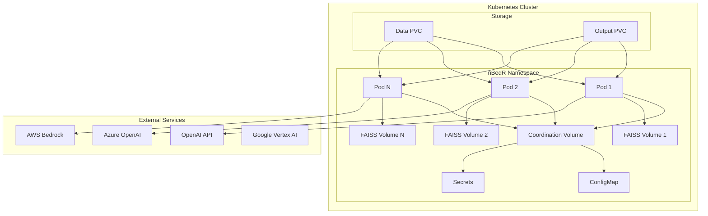

# nBedR Multi-Instance Deployment Guide

This guide provides comprehensive instructions for deploying multiple nBedR instances using Docker and Kubernetes on Azure (AKS), Amazon (EKS), Google Cloud (GKE), and generic Kubernetes clusters.

## Table of Contents

- [Overview](#overview)
- [Docker Deployment](#docker-deployment)
- [Kubernetes Deployment](#kubernetes-deployment)
- [Cloud-Specific Instructions](#cloud-specific-instructions)
- [Configuration](#configuration)
- [Monitoring](#monitoring)
- [Troubleshooting](#troubleshooting)

## Overview

nBedR supports parallel processing through multiple coordinated instances that can process large document collections efficiently while preventing conflicts and ensuring optimal resource utilization.

### Key Features

- **Instance Coordination**: Automatic conflict detection and resolution
- **File Locking**: Safe concurrent access to shared resources
- **Rate Limiting**: Distributed API quota management
- **Horizontal Scaling**: Easy scaling from 1 to dozens of instances
- **Cloud Native**: Optimized for Kubernetes and cloud platforms

### Architecture



## Docker Deployment

### Prerequisites

- Docker 20.10+
- Docker Compose 2.0+
- At least 4GB RAM per instance
- API keys for chosen embedding provider

### Quick Start with Docker Compose

1. **Clone and Navigate**
   ```bash
   git clone <repository-url>
   cd nbedr/deployment/docker
   ```

2. **Configure Environment**
   ```bash
   cp .env.example .env
   # Edit .env with your configuration
   ```

3. **Prepare Data**
   ```bash
   mkdir -p data output
   # Copy your documents to ./data/
   ```

4. **Build and Deploy**
   ```bash
   # Build image
   ../scripts/build-docker.sh

   # Start services
   docker-compose up -d

   # View logs
   docker-compose logs -f
   ```

### Docker Configuration

#### Environment Variables

```bash
# Core Configuration
OPENAI_API_KEY=your_openai_key
EMBEDDING_PROVIDER=openai
EMBEDDING_MODEL=text-embedding-3-small
VECTOR_DB_TYPE=faiss

# Rate Limiting
RATE_LIMIT_ENABLED=true
RATE_LIMIT_REQUESTS_PER_MINUTE=500
RATE_LIMIT_TOKENS_PER_MINUTE=350000

# Instance Coordination
NBEDR_COORDINATION_DIR=/tmp/nbedr_coordination
INSTANCE_ID=docker-instance-1
```

#### Volume Mounts

```yaml
volumes:
  - ./data:/app/data:ro                    # Input documents
  - ./output:/app/output                   # Processing output
  - coordination_data:/tmp/nbedr_coordination  # Instance coordination
  - instance1_faiss:/app/faiss_index       # FAISS vector database
```

### Scaling Docker Instances

```bash
# Scale to 5 instances
docker-compose up -d --scale nbedr-instance-1=5

# Run different document types in parallel
docker-compose up -d nbedr-instance-1 nbedr-instance-2 nbedr-instance-3
```

## Kubernetes Deployment

### Prerequisites

- Kubernetes 1.20+
- kubectl configured
- kustomize or kubectl with kustomize support
- 100GB+ storage for data and output
- Container registry access

### Build and Push Image

```bash
# For Docker Hub
./scripts/build-docker.sh -r your-dockerhub-user -p

# For Azure Container Registry
./scripts/build-docker.sh -r myregistry.azurecr.io -p

# For Amazon ECR
./scripts/build-docker.sh -r 123456789.dkr.ecr.us-west-2.amazonaws.com -p

# For Google Container Registry
./scripts/build-docker.sh -r gcr.io/my-project -p
```

### Generic Kubernetes Deployment

```bash
# Deploy to any Kubernetes cluster
./scripts/deploy-k8s.sh base

# Dry run to see what would be deployed
./scripts/deploy-k8s.sh -d base

# Deploy with custom namespace
./scripts/deploy-k8s.sh -n my-nbedr base
```

### Configuration Steps

1. **Update Image Registry**
   ```bash
   # Edit deployment/kubernetes/base/kustomization.yaml
   images:
   - name: nbedr
     newName: your-registry/nbedr
     newTag: latest
   ```

2. **Configure Secrets**
   ```bash
   # Edit deployment/kubernetes/base/configmap.yaml
   kubectl create secret generic nbedr-secrets \
     --from-literal=OPENAI_API_KEY=your_key \
     -n nbedr
   ```

3. **Storage Configuration**
   ```bash
   # Update storage classes in pvc.yaml
   storageClassName: your-storage-class
   ```

## Cloud-Specific Instructions

### Azure Kubernetes Service (AKS)

#### Prerequisites
- Azure CLI installed and logged in
- AKS cluster with Azure File CSI driver
- Azure Container Registry (ACR)

#### Setup Steps

1. **Create AKS Cluster**
   ```bash
   # Create resource group
   az group create --name nbedr-rg --location eastus

   # Create AKS cluster
   az aks create \
     --resource-group nbedr-rg \
     --name nbedr-aks \
     --node-count 3 \
     --node-vm-size Standard_D4s_v3 \
     --enable-addons azure-file-csi-driver

   # Get credentials
   az aks get-credentials --resource-group nbedr-rg --name nbedr-aks
   ```

2. **Create Azure Container Registry**
   ```bash
   # Create ACR
   az acr create --resource-group nbedr-rg --name nbedrregistry --sku Basic

   # Attach ACR to AKS
   az aks update --resource-group nbedr-rg --name nbedr-aks --attach-acr nbedrregistry
   ```

3. **Configure Storage**
   ```bash
   # Create Azure File share
   az storage account create \
     --resource-group nbedr-rg \
     --name nbedrstorage \
     --location eastus \
     --sku Standard_LRS

   az storage share create \
     --account-name nbedrstorage \
     --name nbedr-data
   ```

4. **Deploy to AKS**
   ```bash
   # Update configuration
   cd deployment/kubernetes/aks
   # Edit kustomization.yaml with your ACR name

   # Deploy
   ../../scripts/deploy-k8s.sh aks
   ```

#### AKS-Specific Configuration

```yaml
# deployment/kubernetes/aks/kustomization.yaml
images:
- name: nbedr
  newName: nbedrregistry.azurecr.io/nbedr
  newTag: latest

configMapGenerator:
- name: nbedr-aks-config
  literals:
  - AZURE_STORAGE_ACCOUNT=nbedrstorage
  - AZURE_CONTAINER_NAME=nbedr-data
```

### Amazon Elastic Kubernetes Service (EKS)

#### Prerequisites
- AWS CLI installed and configured
- eksctl or Terraform for EKS creation
- Amazon ECR repository

#### Setup Steps

1. **Create EKS Cluster**
   ```bash
   # Using eksctl
   eksctl create cluster \
     --name nbedr-eks \
     --region us-west-2 \
     --nodegroup-name nbedr-workers \
     --node-type m5.xlarge \
     --nodes 3 \
     --nodes-min 1 \
     --nodes-max 10
   ```

2. **Create ECR Repository**
   ```bash
   # Create ECR repository
   aws ecr create-repository --repository-name nbedr --region us-west-2

   # Get login token
   aws ecr get-login-password --region us-west-2 | \
     docker login --username AWS --password-stdin \
     123456789.dkr.ecr.us-west-2.amazonaws.com
   ```

3. **Configure IAM Roles**
   ```bash
   # Create IAM role for service account (IRSA)
   eksctl create iamserviceaccount \
     --cluster=nbedr-eks \
     --namespace=nbedr \
     --name=nbedr-eks-service-account \
     --attach-policy-arn=arn:aws:iam::aws:policy/AmazonS3ReadOnlyAccess \
     --attach-policy-arn=arn:aws:iam::aws:policy/AmazonBedrockFullAccess \
     --approve
   ```

4. **Install EFS CSI Driver**
   ```bash
   kubectl apply -k "github.com/kubernetes-sigs/aws-efs-csi-driver/deploy/kubernetes/overlays/stable/?ref=release-1.5"
   ```

5. **Deploy to EKS**
   ```bash
   # Update configuration
   cd deployment/kubernetes/eks
   # Edit kustomization.yaml and service-account.yaml

   # Deploy
   ../../scripts/deploy-k8s.sh eks
   ```

#### EKS-Specific Configuration

```yaml
# deployment/kubernetes/eks/kustomization.yaml
images:
- name: nbedr
  newName: 123456789.dkr.ecr.us-west-2.amazonaws.com/nbedr
  newTag: latest

configMapGenerator:
- name: nbedr-eks-config
  literals:
  - AWS_REGION=us-west-2
  - AWS_S3_BUCKET=your-s3-bucket
```

### Google Kubernetes Engine (GKE)

#### Prerequisites
- Google Cloud SDK installed and authenticated
- GKE cluster with required APIs enabled
- Google Container Registry or Artifact Registry

#### Setup Steps

1. **Create GKE Cluster**
   ```bash
   # Enable required APIs
   gcloud services enable container.googleapis.com

   # Create cluster
   gcloud container clusters create nbedr-gke \
     --zone=us-central1-a \
     --machine-type=n1-standard-4 \
     --num-nodes=3 \
     --enable-autoscaling \
     --min-nodes=1 \
     --max-nodes=10 \
     --workload-pool=your-project-id.svc.id.goog
   ```

2. **Configure Workload Identity**
   ```bash
   # Create Google Service Account
   gcloud iam service-accounts create nbedr-gsa \
     --display-name="nBedR Service Account"

   # Grant permissions
   gcloud projects add-iam-policy-binding your-project-id \
     --member="serviceAccount:nbedr-gsa@your-project-id.iam.gserviceaccount.com" \
     --role="roles/storage.objectAdmin"

   # Enable Workload Identity
   gcloud iam service-accounts add-iam-policy-binding \
     nbedr-gsa@your-project-id.iam.gserviceaccount.com \
     --role roles/iam.workloadIdentityUser \
     --member "serviceAccount:your-project-id.svc.id.goog[nbedr/nbedr-gke-service-account]"
   ```

3. **Deploy to GKE**
   ```bash
   # Configure Docker for GCR
   gcloud auth configure-docker

   # Update configuration
   cd deployment/kubernetes/gke
   # Edit kustomization.yaml

   # Deploy
   ../../scripts/deploy-k8s.sh gke
   ```

#### GKE-Specific Configuration

```yaml
# deployment/kubernetes/gke/kustomization.yaml
images:
- name: nbedr
  newName: gcr.io/your-project-id/nbedr
  newTag: latest

configMapGenerator:
- name: nbedr-gke-config
  literals:
  - GOOGLE_CLOUD_PROJECT=your-project-id
  - GCS_BUCKET=your-gcs-bucket
```

## Configuration

### Resource Requirements

#### Minimum Requirements (per instance)
- **CPU**: 250m (0.25 cores)
- **Memory**: 512Mi
- **Storage**: 10Gi (FAISS index)

#### Recommended Requirements (per instance)
- **CPU**: 1000m (1 core)
- **Memory**: 2Gi
- **Storage**: 50Gi (FAISS index)

#### High-Performance Setup (per instance)
- **CPU**: 2000m (2 cores)
- **Memory**: 4Gi
- **Storage**: 100Gi (FAISS index)

### Scaling Guidelines

| Document Count | Instances | CPU per Instance | Memory per Instance |
|----------------|-----------|------------------|---------------------|
| < 1K          | 1-2       | 250m            | 512Mi               |
| 1K - 10K       | 2-5       | 500m            | 1Gi                 |
| 10K - 100K     | 5-10      | 1000m           | 2Gi                 |
| 100K - 1M      | 10-20     | 2000m           | 4Gi                 |
| > 1M           | 20+       | 2000m           | 4Gi                 |

### Rate Limiting Configuration

```yaml
# For multiple instances, divide total rate limit
# Example: 500 RPM across 5 instances = 100 RPM per instance

configMap:
  RATE_LIMIT_ENABLED: "true"
  RATE_LIMIT_REQUESTS_PER_MINUTE: "100"  # 500 / 5 instances
  RATE_LIMIT_TOKENS_PER_MINUTE: "70000"  # 350000 / 5 instances
  RATE_LIMIT_STRATEGY: "sliding_window"
```

## Monitoring

### Kubernetes Monitoring

```bash
# View pod status
kubectl get pods -n nbedr -w

# View pod logs
kubectl logs -n nbedr -l app.kubernetes.io/name=nbedr -f

# View resource usage
kubectl top pods -n nbedr

# View events
kubectl get events -n nbedr --sort-by='.lastTimestamp'

# Check coordination status
kubectl exec -n nbedr deployment/nbedr-deployment -- \
  python3 nbedr.py create-embeddings --list-instances
```

### Instance Coordination Monitoring

```bash
# Check coordination files
kubectl exec -n nbedr deployment/nbedr-deployment -- \
  ls -la /tmp/nbedr_coordination/

# View instance registry
kubectl exec -n nbedr deployment/nbedr-deployment -- \
  cat /tmp/nbedr_coordination/instances.json

# View document processing status
kubectl exec -n nbedr deployment/nbedr-deployment -- \
  cat /tmp/nbedr_coordination/documents.json
```

### Document Coordination Monitoring

```bash
# Check document locks
kubectl exec -n nbedr deployment/nbedr-deployment -- \
  ls -la /tmp/nbedr_coordination/locks/

# List active instances
kubectl exec -n nbedr deployment/nbedr-deployment -- \
  python3 nbedr.py create-embeddings --list-instances

# Clean up stale document locks
kubectl exec -n nbedr deployment/nbedr-deployment -- \
  python3 nbedr.py create-embeddings --cleanup-locks

# Reset failed documents for reprocessing
kubectl exec -n nbedr deployment/nbedr-deployment -- \
  python3 nbedr.py create-embeddings --reset-failed
```

### Performance Metrics

Monitor these key metrics:
- **Processing Rate**: Documents per minute
- **API Usage**: Requests and tokens per minute
- **Resource Usage**: CPU and memory utilization
- **Storage Growth**: FAISS index and output sizes
- **Error Rates**: Failed document processing

## Troubleshooting

### Common Issues

#### 1. Instance Conflicts
```bash
# Error: Multiple instances writing to same path
# Solution: Check instance coordination

kubectl logs -n nbedr deployment/nbedr-deployment | grep "conflict"
```

#### 2. Document Contention
```bash
# Error: Multiple instances processing same documents
# Solution: Check document coordination

# View document processing status
kubectl exec -n nbedr deployment/nbedr-deployment -- \
  cat /tmp/nbedr_coordination/documents.json

# Check for stale locks
kubectl exec -n nbedr deployment/nbedr-deployment -- \
  find /tmp/nbedr_coordination/locks/ -name "*.lock" -mmin +60

# Clean up stale locks
kubectl exec -n nbedr deployment/nbedr-deployment -- \
  python3 nbedr.py create-embeddings --cleanup-locks
```

#### 3. Rate Limit Violations
```bash
# Error: API rate limits exceeded
# Solution: Reduce per-instance rate limits

kubectl edit configmap nbedr-config -n nbedr
# Reduce RATE_LIMIT_REQUESTS_PER_MINUTE
```

#### 4. Storage Issues
```bash
# Error: No space left on device
# Solution: Increase PVC size

kubectl patch pvc nbedr-output-pvc -n nbedr \
  -p '{"spec":{"resources":{"requests":{"storage":"200Gi"}}}}'
```

#### 5. Image Pull Errors
```bash
# Error: ImagePullBackOff
# Solution: Check registry authentication

# For ACR
az acr login --name your-registry

# For ECR
aws ecr get-login-password | docker login --username AWS --password-stdin

# For GCR
gcloud auth configure-docker
```

### Debug Commands

```bash
# Check cluster resources
kubectl describe nodes

# Check storage classes
kubectl get storageclass

# Check persistent volumes
kubectl get pv,pvc -n nbedr

# Check service accounts and RBAC
kubectl get sa,clusterrole,clusterrolebinding -n nbedr

# Describe problematic pods
kubectl describe pod -n nbedr <pod-name>

# Execute commands in pods
kubectl exec -it -n nbedr deployment/nbedr-deployment -- /bin/bash
```

### Performance Tuning

#### CPU Optimization
```yaml
# Increase CPU limits for faster processing
resources:
  limits:
    cpu: "4000m"
  requests:
    cpu: "2000m"
```

#### Memory Optimization
```yaml
# Increase memory for large document processing
resources:
  limits:
    memory: "8Gi"
  requests:
    memory: "4Gi"
```

#### I/O Optimization
```yaml
# Use high-performance storage classes
spec:
  storageClassName: fast-ssd  # or premium-lrs, gp3-csi, etc.
```

## Best Practices

### Security
- Use least-privilege service accounts
- Store API keys in Kubernetes secrets
- Enable network policies
- Use private container registries
- Regular security scanning

### Reliability
- Set appropriate resource requests and limits
- Configure health checks and readiness probes
- Use PodDisruptionBudgets for graceful updates
- Implement proper backup strategies
- Monitor and alert on failures

### Cost Optimization
- Use node auto-scaling
- Right-size resource requests
- Use spot/preemptible instances where appropriate
- Implement API quota monitoring
- Clean up unused resources

For additional support and advanced configurations, please refer to the main nBedR documentation or submit issues to the project repository.