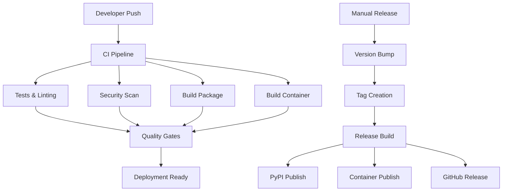

# Build and Release Process

This document describes the complete build and release process for nBedR, including automated workflows, manual procedures, and troubleshooting guides.

## Table of Contents

- [Overview](#overview)
- [Prerequisites](#prerequisites)
- [Development Workflow](#development-workflow)
- [Automated CI/CD Pipeline](#automated-cicd-pipeline)
- [Release Process](#release-process)
- [Version Management](#version-management)
- [Building Packages](#building-packages)
- [Container Images](#container-images)
- [Troubleshooting](#troubleshooting)

## Overview

nBedR uses a comprehensive CI/CD pipeline with automated testing, building, and releasing capabilities. The system supports:

- **Automated CI/CD**: Continuous integration and deployment using GitHub Actions
- **Semantic Versioning**: Automatic version management with patch, minor, and major releases
- **Multiple Package Formats**: PyPI packages and Docker containers
- **Multi-Platform Support**: Linux AMD64 and ARM64 architectures
- **Security Scanning**: Automated vulnerability detection
- **Release Automation**: Changelog integration and release note generation

### Architecture



## Prerequisites

### Development Environment

- **Python**: 3.9, 3.10, or 3.11
- **Git**: Latest version
- **Docker**: For container building (optional)
- **GitHub CLI**: For release management (optional)

### GitHub Repository Setup

1. **Secrets Configuration**:
   ```bash
   # Required for PyPI publishing
   PYPI_API_TOKEN=pypi-token-here
   
   # Automatically available
   GITHUB_TOKEN=automatically-provided
   ```

2. **Environments**:
   - `staging`: For staging deployments
   - `pypi`: For PyPI publishing protection

3. **Branch Protection**:
   - `main`: Requires PR reviews, status checks
   - `develop`: Development branch for feature integration

## Development Workflow

### 1. Feature Development

```bash
# Create feature branch
git checkout -b feature/your-feature-name

# Make changes and commit
git add .
git commit -m "feat: add new feature

🤖 Generated with [Claude Code](https://claude.ai/code)

Co-Authored-By: Claude <noreply@anthropic.com>"

# Push and create PR
git push origin feature/your-feature-name
```

### 2. Local Testing

```bash
# Install development dependencies
pip install -e .[dev,all]

# Run full test suite
pytest tests/ -v --cov=core --cov=cli

# Run linting and formatting
black .
isort .
flake8 .
mypy core/ cli/

# Run security checks
bandit -r core/ cli/
```

### 3. Local Package Building

```bash
# Build Python package
python -m build

# Test installation
pip install dist/rag_embeddings_db-*.whl

# Test CLI
nbedr --help
```

### 4. Local Container Building

```bash
# Build Docker image
docker build -f deployment/docker/Dockerfile -t nbedr:local .

# Test container
docker run --rm -e EMBEDDING_PROVIDER=mock nbedr:local nbedr --help
```

## Automated CI/CD Pipeline

### Trigger Events

- **Push to main/develop**: Full CI pipeline
- **Pull Requests**: Full CI pipeline
- **Manual Trigger**: Via GitHub Actions UI

### Pipeline Stages

#### 1. **Test Stage**
- **Matrix Testing**: Python 3.9, 3.10, 3.11
- **Code Quality**: Black, isort, flake8, mypy
- **Security**: Bandit security scanning
- **Unit Tests**: Comprehensive test coverage
- **Integration Tests**: End-to-end workflow testing

#### 2. **Build Stage**
- **Python Package**: Wheel and source distribution
- **Docker Image**: Multi-platform (AMD64, ARM64)
- **Artifact Upload**: Package preservation

#### 3. **Security Stage**
- **Container Scanning**: Trivy vulnerability detection
- **Dependency Checking**: Known vulnerability detection
- **SARIF Upload**: Security findings integration

#### 4. **Deploy Stage** (develop branch only)
- **Staging Deployment**: Automatic staging environment deployment
- **Smoke Tests**: Basic functionality verification

### Workflow Files

- **`.github/workflows/ci.yml`**: Main CI/CD pipeline
- **`.github/workflows/release.yml`**: Release automation

## Release Process

### Manual Release Trigger

1. **Navigate to Actions**: Go to GitHub Actions tab
2. **Select Release Workflow**: Choose "Release" workflow
3. **Run Workflow**: Configure release parameters

#### Release Parameters

- **Version Type**:
  - `patch`: Bug fixes (1.0.0 → 1.0.1)
  - `minor`: New features (1.0.0 → 1.1.0)
  - `major`: Breaking changes (1.0.0 → 2.0.0)

- **Pre-release**: Mark as pre-release version
- **Draft**: Create draft release for review

### Automated Release Steps

1. **Version Calculation**: Automatic version bump based on type
2. **File Updates**: Update `pyproject.toml` and `CHANGELOG.md`
3. **Git Operations**: Commit changes and create tag
4. **Package Building**: Create Python package
5. **Container Building**: Build and push Docker image
6. **Release Creation**: GitHub release with changelog
7. **PyPI Publishing**: Automatic package publishing

### Release Artifacts

- **GitHub Release**: Version tag with release notes
- **PyPI Package**: `pip install nbedr==x.x.x`
- **Docker Image**: `ghcr.io/your-org/nbedr:vx.x.x`
- **Source Code**: Tagged source archive

## Version Management

### Semantic Versioning

nBedR follows [Semantic Versioning 2.0.0](https://semver.org/):

- **MAJOR**: Incompatible API changes
- **MINOR**: Backward-compatible functionality additions
- **PATCH**: Backward-compatible bug fixes

### Version Sources

- **Primary**: `pyproject.toml` `project.version`
- **Automatic Update**: Release workflow updates version
- **Tag Creation**: Git tags match package versions

### Maintenance Releases

For patch releases on previous versions:

```bash
# Create maintenance branch from tag
git checkout -b maint/v1.5.x v1.5.0

# Apply fixes
git cherry-pick <commit-hash>

# Manual release trigger with patch version
# Release workflow will create v1.5.1
```

## Building Packages

### Python Package

#### Local Development Build

```bash
# Install build tools
pip install build twine

# Build package
python -m build

# Verify package
twine check dist/*

# Local installation test
pip install dist/*.whl
```

#### Package Structure

```
dist/
├── rag_embeddings_db-x.x.x-py3-none-any.whl  # Wheel distribution
└── rag_embeddings_db-x.x.x.tar.gz           # Source distribution
```

#### Package Metadata

- **Name**: `nbedr`
- **Entry Point**: `nbedr = cli.main:main`
- **Dependencies**: Listed in `pyproject.toml`
- **Optional Dependencies**: `[dev]`, `[cloud]`, `[all]`

### PyPI Publishing

#### Automated (Recommended)

- **Trigger**: Release workflow
- **Authentication**: `PYPI_API_TOKEN` secret
- **Protection**: Environment protection rules

#### Manual Publishing

```bash
# Upload to Test PyPI
twine upload --repository testpypi dist/*

# Upload to PyPI
twine upload dist/*
```

## Container Images

### Docker Build Process

#### Multi-Stage Build

1. **Base Stage**: Python runtime setup
2. **Dependencies Stage**: Install Python packages
3. **Application Stage**: Copy application code
4. **Final Stage**: Optimized runtime image

#### Build Configuration

```dockerfile
# Multi-platform support
FROM python:3.11-slim

# Security: Non-root user
RUN useradd --create-home --shell /bin/bash nbedr
USER nbedr

# Optimization: Dependency caching
COPY requirements.txt .
RUN pip install --no-cache-dir -r requirements.txt

# Application: Copy and install
COPY . .
RUN pip install --no-deps .

# Runtime: Entry point
ENTRYPOINT ["nbedr"]
```

### Container Registry

#### GitHub Container Registry

- **Registry**: `ghcr.io`
- **Authentication**: `GITHUB_TOKEN`
- **Visibility**: Public repository images

#### Image Tags

- **Version**: `ghcr.io/your-org/nbedr:v1.0.0`
- **Latest**: `ghcr.io/your-org/nbedr:latest`
- **Branch**: `ghcr.io/your-org/nbedr:main`
- **SHA**: `ghcr.io/your-org/nbedr:main-abc1234`

### Platform Support

- **linux/amd64**: x86_64 architecture
- **linux/arm64**: ARM64 architecture (Apple Silicon, ARM servers)

### Container Usage

```bash
# Pull latest image
docker pull ghcr.io/your-org/nbedr:latest

# Run with environment variables
docker run --rm \
  -e OPENAI_API_KEY="your-key" \
  -e EMBEDDING_PROVIDER="openai" \
  -v $(pwd)/data:/app/data \
  ghcr.io/your-org/nbedr:latest \
  create-embeddings --source local --local-path /app/data
```

## Troubleshooting

### Common CI/CD Issues

#### 1. **Test Failures**

```bash
# Run tests locally with same environment
pytest tests/ -v --tb=short

# Check test coverage
pytest tests/ --cov=core --cov=cli --cov-report=html
open htmlcov/index.html
```

#### 2. **Build Failures**

```bash
# Verify package build locally
python -m build
twine check dist/*

# Check dependency conflicts
pip-check
```

#### 3. **Docker Build Issues**

```bash
# Build with debug output
docker build --progress=plain -f deployment/docker/Dockerfile .

# Check layer caching
docker build --no-cache -f deployment/docker/Dockerfile .
```

#### 4. **Version Conflicts**

```bash
# Check current version
python -c "import tomllib; print(tomllib.load(open('pyproject.toml', 'rb'))['project']['version'])"

# Verify git tags
git tag -l | sort -V
```

### Release Issues

#### 1. **Failed Version Bump**

- **Check**: Git permissions and branch protection
- **Solution**: Ensure `GITHUB_TOKEN` has write permissions

#### 2. **PyPI Publishing Failure**

- **Check**: `PYPI_API_TOKEN` secret configuration
- **Solution**: Regenerate API token with correct permissions

#### 3. **Container Push Failure**

- **Check**: GitHub Container Registry permissions
- **Solution**: Verify `GITHUB_TOKEN` has package write permissions

### Debugging Workflows

#### 1. **Enable Debug Logging**

```yaml
# Add to workflow steps
- name: Debug Step
  run: |
    echo "Debug information:"
    env | sort
    ls -la
  env:
    ACTIONS_STEP_DEBUG: true
```

#### 2. **Workflow Artifacts**

- **Download**: Artifacts from failed runs
- **Inspect**: Logs and build outputs
- **Compare**: Successful vs failed runs

#### 3. **Local Workflow Testing**

```bash
# Install act for local workflow testing
brew install act

# Run workflow locally
act -W .github/workflows/ci.yml
```

### Performance Optimization

#### 1. **Cache Optimization**

- **Pip Cache**: Speeds up dependency installation
- **Docker Cache**: Reduces build times
- **Action Cache**: Caches workflow artifacts

#### 2. **Parallel Execution**

- **Matrix Builds**: Parallel Python version testing
- **Job Dependencies**: Optimize workflow DAG

#### 3. **Resource Limits**

- **Timeout**: Prevent hanging jobs
- **Concurrency**: Limit parallel workflow runs

### Security Considerations

#### 1. **Secret Management**

- **Rotation**: Regular API token rotation
- **Scope**: Minimal permission requirements
- **Environment**: Production secret protection

#### 2. **Vulnerability Scanning**

- **Dependencies**: Regular dependency updates
- **Containers**: Trivy scanning integration
- **Code**: Bandit security analysis

#### 3. **Supply Chain Security**

- **Pin Versions**: Lock dependency versions
- **Verification**: Package signature verification
- **Provenance**: Build artifact attestation

## Monitoring and Metrics

### Build Metrics

- **Success Rate**: CI/CD pipeline success percentage
- **Build Time**: Average build duration
- **Test Coverage**: Code coverage trends

### Release Metrics

- **Release Frequency**: Release cadence tracking
- **Time to Release**: Feature development to release time
- **Rollback Rate**: Failed release percentage

### Quality Metrics

- **Security Issues**: Vulnerability trends
- **Code Quality**: Linting and complexity metrics
- **Test Reliability**: Flaky test identification

---

## Quick Reference

### Common Commands

```bash
# Local development
pip install -e .[dev,all]
pytest tests/ -v
black . && isort . && flake8 .

# Package building
python -m build
twine check dist/*

# Container building
docker build -f deployment/docker/Dockerfile -t nbedr:local .

# Release (GitHub UI)
# Actions → Release → Run workflow → Select version type
```

### Important Files

- **`pyproject.toml`**: Package configuration and version
- **`CHANGELOG.md`**: Release notes and history
- **`.github/workflows/`**: CI/CD workflow definitions
- **`deployment/docker/Dockerfile`**: Container build configuration
- **`requirements.txt`**: Python dependencies

### Support

- **Issues**: [GitHub Issues](https://github.com/your-org/nbedr/issues)
- **Discussions**: [GitHub Discussions](https://github.com/your-org/nbedr/discussions)
- **Documentation**: [README.md](../README.md)

---

*This document is automatically updated with each release. Last updated: $(date +%Y-%m-%d)*