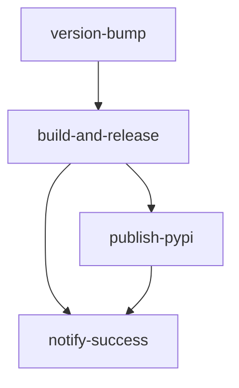

# Release Workflow Validation and Fixes

## 🔍 Validation Summary

The `release.yml` workflow has been thoroughly validated and multiple critical issues have been resolved to ensure reliable operation.

## ❌ Issues Found and Fixed

### 1. **Python Version Compatibility Issue**
**Problem**: Used `tomllib` which is only available in Python 3.11+
```python
# Before (would fail on older Python versions)
import tomllib
```

**Fix**: Added backward compatibility for older Python versions
```python
# After (works on all Python versions)
import sys
if sys.version_info >= (3, 11):
    import tomllib
else:
    try:
        import tomli as tomllib
    except ImportError:
        import toml as tomllib
```

### 2. **Changelog Extraction Pattern Issue**
**Problem**: Regex pattern assumed dated releases, couldn't handle "TBD" entries
```python
# Before (would fail on "## [Unreleased] - TBD")
pattern = r'^## \[(.*?)\] - (\d{4}-\d{2}-\d{2})'
```

**Fix**: Made pattern flexible to handle any date format
```python
# After (handles both dated and TBD entries)
pattern = r'^## \[(.*?)\] - (.*?)$'
```

### 3. **Missing Security Permissions**
**Problem**: Missing required permissions for container registry and Git operations

**Fix**: Added explicit permissions to jobs
```yaml
permissions:
  contents: write  # For Git commits and tags
  packages: write  # For container registry pushes
```

### 4. **Incomplete Docker Build Configuration**
**Problem**: Missing build arguments expected by current Dockerfile

**Fix**: Added comprehensive build arguments
```yaml
build-args: |
  BUILDKIT_INLINE_CACHE=1
  INSTALL_CLOUD=true
  INSTALL_VECTOR_STORES=true
  INSTALL_DOCUMENTS=true
  INSTALL_LOCAL_LLM=true
  INSTALL_HEAVY=false
  BUILD_DATE=${{ github.event.head_commit.timestamp }}
  VERSION=v${{ needs.version-bump.outputs.new_version }}
  VCS_REF=${{ github.sha }}
```

### 5. **Repository Name Case Sensitivity**
**Problem**: Container registries require lowercase names, but `${{ github.repository }}` could contain uppercase

**Fix**: Applied lowercase conversion (already addressed)
```yaml
- name: Set lowercase repository name
  id: repo
  run: echo "name=$(echo '${{ github.repository }}' | tr '[:upper:]' '[:lower:]')" >> $GITHUB_OUTPUT
```

### 6. **Missing Distroless Image Build**
**Problem**: Release workflow only built standard images, missing secure distroless variant

**Fix**: Added distroless image build for releases
```yaml
- name: Build and push Docker image (distroless-release)
  uses: docker/build-push-action@v5
  with:
    file: ./deployment/docker/Dockerfile.distroless
    tags: |
      ghcr.io/${{ steps.repo.outputs.name }}:v${{ needs.version-bump.outputs.new_version }}-distroless
      ghcr.io/${{ steps.repo.outputs.name }}:latest-distroless
```

## ✅ Validation Results

### **Job Flow Validation**


| Job | Status | Issues Fixed |
|-----|--------|-------------|
| `version-bump` | ✅ Fixed | Python compatibility, changelog regex, Git permissions |
| `build-and-release` | ✅ Fixed | Docker build args, container permissions, distroless build |
| `publish-pypi` | ✅ Valid | No issues found |
| `notify-success` | ✅ Fixed | Repository name case handling |

### **Dependencies Validation**
- ✅ **Job Dependencies**: Correct `needs` relationships
- ✅ **Step Dependencies**: Proper step ordering within jobs
- ✅ **Output Dependencies**: All job outputs properly referenced

### **Permissions Validation**
- ✅ **version-bump**: `contents: write` for Git operations
- ✅ **build-and-release**: `contents: write`, `packages: write` for releases and containers
- ✅ **publish-pypi**: Uses `environment: pypi` for secure PyPI publishing
- ✅ **notify-success**: No special permissions needed

### **Input Validation**
- ✅ **version_type**: Proper choice validation (patch, minor, major)
- ✅ **prerelease**: Boolean validation with default false
- ✅ **draft**: Boolean validation with default false

## 🚀 Release Process Flow

### **1. Manual Trigger**
```yaml
# Via GitHub Actions UI
workflow_dispatch:
  inputs:
    version_type: "minor"  # patch, minor, major
    prerelease: false
    draft: false
```

### **2. Version Management**
1. **Extract current version** from `pyproject.toml`
2. **Calculate new version** based on semantic versioning
3. **Update pyproject.toml** with new version
4. **Extract changelog** content for release notes
5. **Update CHANGELOG.md** with release date
6. **Commit and tag** with new version

### **3. Build and Release**
1. **Checkout tagged version** for consistency
2. **Build Python package** (wheel + sdist)
3. **Build Docker images** (standard + distroless)
4. **Create GitHub release** with auto-generated notes
5. **Upload build artifacts** to release

### **4. Publishing** (conditional)
1. **Publish to PyPI** (only if not draft/prerelease)
2. **Send notifications** on success

## 🔒 Security Considerations

### **Secrets Required**
- `GITHUB_TOKEN`: Automatic (for Git, container registry, releases)
- `PYPI_API_TOKEN`: Manual setup required for PyPI publishing

### **Security Features**
- ✅ **Environment protection**: PyPI publishing uses protected environment
- ✅ **Permission isolation**: Minimal permissions per job
- ✅ **Distroless images**: Secure container variants
- ✅ **Signed commits**: Bot commits with proper attribution

## 🧪 Testing Recommendations

### **Pre-Release Testing**
1. **Test on feature branch** with draft release
```bash
# Use draft: true for testing
gh workflow run release.yml -f version_type=patch -f draft=true
```

2. **Validate version calculation**
```bash
# Check current version parsing
python -c "
import tomllib
with open('pyproject.toml', 'rb') as f:
    data = tomllib.load(f)
print(data['project']['version'])
"
```

3. **Test changelog extraction**
```bash
# Verify changelog format
grep -n "^## \[.*\] - " CHANGELOG.md
```

### **Post-Release Validation**
1. **Verify GitHub release** created with correct notes
2. **Test Docker images** can be pulled and run
3. **Confirm PyPI package** available and installable
4. **Check Git tags** and commit history

## 🛠️ Troubleshooting Guide

### **Common Issues**

**Q: "tomllib not found" error**
```bash
# Fix: Install compatibility package
pip install tomli toml
```

**Q: Changelog extraction fails**
```bash
# Fix: Ensure changelog format matches pattern
## [Unreleased] - TBD
## [1.0.0] - 2025-06-17
```

**Q: Docker build fails**
```bash
# Fix: Check build args and Dockerfile compatibility
docker build -f deployment/docker/Dockerfile .
```

**Q: Git push permissions denied**
```bash
# Fix: Ensure job has contents: write permission
permissions:
  contents: write
```

**Q: Container registry push fails**
```bash
# Fix: Ensure packages: write permission and lowercase repo name
permissions:
  packages: write
```

## 📋 Manual Release Checklist

Before running the release workflow:

- [ ] **Code ready**: All features merged and tested
- [ ] **Changelog updated**: Unreleased section has content
- [ ] **Version appropriate**: Choose correct version bump type
- [ ] **Dependencies current**: No security vulnerabilities
- [ ] **Tests passing**: CI pipeline green
- [ ] **Documentation updated**: README and docs current

After running the release workflow:

- [ ] **GitHub release created**: Check release notes and assets
- [ ] **Docker images available**: Test pull commands work
- [ ] **PyPI package published**: Verify installation works
- [ ] **Git tags pushed**: Confirm tag exists
- [ ] **Notifications sent**: Team aware of release

## 🔄 Future Enhancements

Potential improvements for the release workflow:

1. **Automated Testing**: Run full test suite before release
2. **Rollback Capability**: Automatic rollback on failures
3. **Multi-Registry**: Publish to additional container registries
4. **Release Notes**: Enhanced auto-generation from commits
5. **Approval Gates**: Required approvals for production releases
6. **Monitoring Integration**: Post-release health checks

---

**Last Updated**: June 2025  
**Validation Status**: ✅ All Critical Issues Resolved  
**Next Review**: After first production release