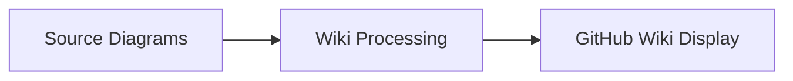

# Wiki Documentation System

## Overview

The nBedR project includes an automated documentation wiki system that publishes project documentation to GitHub Wiki during CI builds. This system ensures the wiki stays synchronized with the repository documentation.

## How It Works

### Automated Publication

The wiki is updated in these controlled scenarios:

1. **Manual Triggers**: You can manually trigger wiki updates via GitHub Actions workflow dispatch
2. **Post-Release**: After successful completion of the release workflow
3. **No Automatic Pushes**: Wiki is NOT updated on every code push to maintain clean CI pipelines

### Change Detection

The system is smart about updates:
- Only rebuilds the wiki when documentation files actually change
- Tracks content hashes to avoid unnecessary updates
- Processes only the files that need updating

## Architecture

### Components

1. **`wiki-config.yaml`**: Configuration for page mapping and navigation
2. **`scripts/generate-wiki.py`**: Python script that processes documentation into wiki pages
3. **`.github/workflows/ci.yml`**: CI integration for automatic publishing
4. **`.github/workflows/release.yml`**: Release-specific wiki updates

### File Mapping

The system maps repository files to wiki pages:

```yaml
# Source files → Wiki pages
README.md → Home.md
CHANGELOG.md → Changelog.md
docs/BUILD.md → Build-and-Development.md
docs/DEVELOPMENT.md → Development-Guide.md
deployment/ → Deployment-Guide.md (consolidated)
```

## Configuration

### wiki-config.yaml Structure

```yaml
wiki:
  title: "nBedR Documentation"
  pages:
    "README.md": "Home.md"
    "docs/BUILD.md": "Build-and-Development.md"
  navigation:
    - title: "Getting Started"
      pages: ["Home", "Build-and-Development"]
  processing:
    convert_links: true
    toc_min_length: 1000
    include_timestamps: true
```

### Key Features

- **Link Conversion**: Automatically converts relative links to wiki links
- **Table of Contents**: Auto-generates TOCs for long pages
- **Navigation Sidebar**: Creates structured navigation
- **Mermaid Support**: Processes diagrams for wiki compatibility
- **Timestamps**: Adds last-updated information

## Content Processing

### Link Processing

The system automatically converts:
- `[text](docs/file.md)` → `[text](Wiki-Page)`
- Relative links to appropriate wiki page references
- Maintains external links unchanged

### Content Consolidation

Some directories are consolidated into single pages:
- **deployment/**: All deployment docs → `Deployment-Guide.md`
- **templates/**: Template documentation → `Templates.md`

### Mermaid Diagrams

Mermaid diagrams are processed for GitHub Wiki compatibility:


## Initial Setup

### First-Time Wiki Initialization

GitHub Wikis must be manually initialized before automation can take over:

**Steps to initialize:**
1. Go to `https://github.com/[owner]/[repo]/wiki`
2. Click "Create the first page" 
3. Add any initial content (will be replaced by automation)
4. Save the page
5. Automation will take over from here!

### Manual Usage (After Initialization)

```bash
# Generate all wiki pages
python scripts/generate-wiki.py

# Check for changes only
python scripts/generate-wiki.py --check-changes

# Force regeneration
python scripts/generate-wiki.py --force

# Custom configuration
python scripts/generate-wiki.py --config custom-wiki-config.yaml
```

### Development Workflow

1. **Edit Documentation**: Modify files in `docs/`, `README.md`, etc.
2. **Test Locally**: Run `python scripts/generate-wiki.py` to preview
3. **Commit Changes**: Push to main branch (CI runs but no wiki update)
4. **Manual Publishing**: Use GitHub Actions to manually trigger wiki update
5. **Release Publishing**: Wiki automatically updates after successful releases

## Directory Structure

```
nbedr/
├── wiki-config.yaml          # Wiki configuration
├── scripts/
│   └── generate-wiki.py       # Wiki generator script
├── .wikiignore               # Files to exclude from wiki
├── wiki/                     # Generated wiki content (local)
├── docs/                     # Source documentation
├── deployment/               # Deployment documentation
└── templates/                # Template files
```

## CI/CD Integration

### Triggers

The wiki publishing runs when:
- **Manual workflow dispatch**: Via GitHub Actions UI with optional force update
- **Successful release completion**: After the release workflow completes successfully
- **Not on code pushes**: Removed from CI pipeline to keep it fast and focused

### Workflow Steps

1. **Change Detection**: Check if documentation files changed
2. **Content Generation**: Run wiki generator script
3. **Wiki Update**: Clone wiki repository and update pages
4. **Commit & Push**: Commit changes to wiki repository

### Permissions

The workflow requires:
- `contents: write` permission for wiki access
- Standard `GITHUB_TOKEN` for authentication

## Troubleshooting

### Common Issues

**Q: Wiki not updating despite documentation changes**
```bash
# Check if files are excluded in .wikiignore
cat .wikiignore

# Manually trigger update
gh workflow run ci.yml
```

**Q: Wiki generation fails locally**
```bash
# Install dependencies
pip install pyyaml

# Check for syntax errors
python -m py_compile scripts/generate-wiki.py
```

**Q: Links not converting properly**
```bash
# Check wiki-config.yaml for proper mapping
# Ensure source files exist
ls -la docs/
```

### Debug Mode

Enable debug output:
```bash
python scripts/generate-wiki.py --force 2>&1 | tee wiki-debug.log
```

## Customization

### Adding New Documentation

1. **Create Documentation**: Add files to `docs/` or other directories
2. **Update Configuration**: Add mapping in `wiki-config.yaml`
3. **Update Navigation**: Add to navigation structure
4. **Test**: Run generator locally to verify

### Custom Processing

Extend the `WikiGenerator` class to add:
- Custom content transformations
- Additional file type support
- Special formatting rules

### Navigation Customization

Modify the navigation structure in `wiki-config.yaml`:
```yaml
navigation:
  - title: "Your Section"
    pages:
      - "Your-Page"
      - "Another-Page"
```

## Best Practices

### Documentation Writing

1. **Wiki-Friendly**: Write with wiki publication in mind
2. **Relative Links**: Use relative links for internal references
3. **Clear Headings**: Use proper heading hierarchy
4. **Mermaid Diagrams**: Use standard Mermaid syntax

### Maintenance

1. **Regular Reviews**: Review wiki structure periodically
2. **Link Validation**: Check for broken links
3. **Navigation Updates**: Keep navigation current with content
4. **Performance**: Monitor generation time and optimize if needed

## Future Enhancements

Potential improvements:
- **Search Integration**: Add search functionality
- **Version Management**: Wiki versioning for releases
- **Analytics**: Track wiki usage and popular pages
- **Templates**: Custom page templates
- **Multi-language**: Support for multiple languages

---

**Last Updated**: 2025-06-17  
**Version**: 1.0  
**Maintainer**: nBedR Team